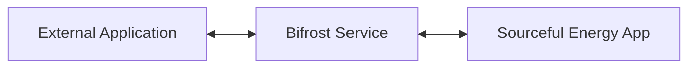
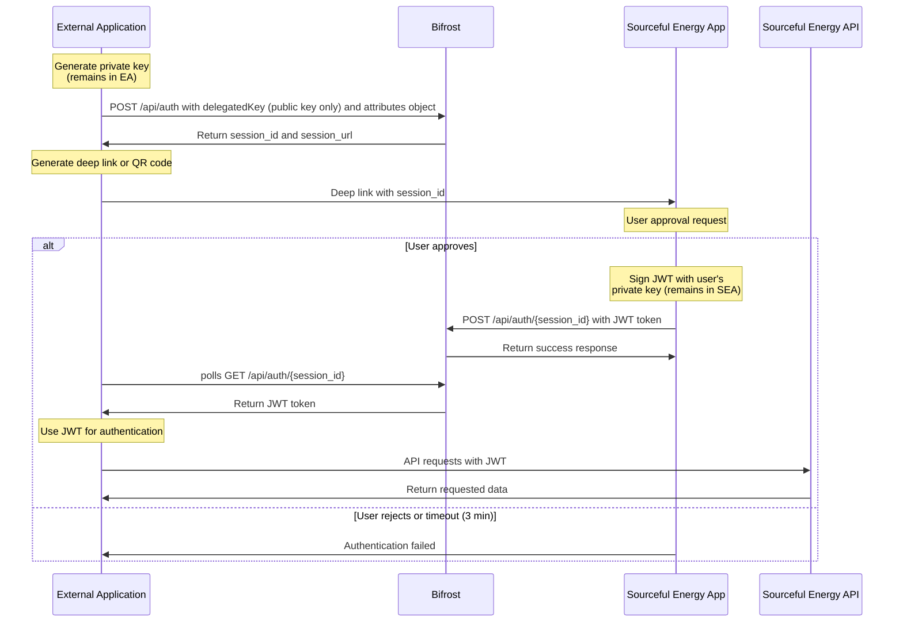
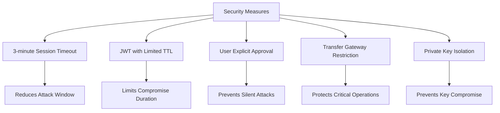
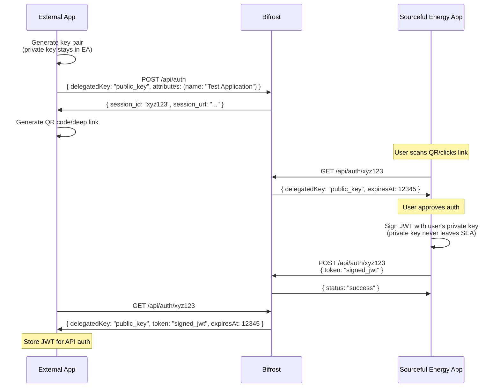

# Authentication & Permissioning

“Connect with Sourceful” is our OAuth‑style permissioning model. Users approve explicit scopes, and client apps receive a short‑lived, signed token to call Sourceful APIs according to granted permissions. Bifrost is the bridge service that facilitates this delegated authentication flow.

## Bifrost Authentication Service

Bifrost is an authentication service that enables secure communication between external applications and the Sourceful Energy App (SEA). It serves as a bridge that facilitates safe authentication without requiring users to install external wallets on multiple devices. In short, Bifrost exchanges a delegation token that grants the token owner permission to access some of the user’s resources.

> **Security by Design**: Bifrost only handles public keys, never private keys. All private keys remain securely within either the SEA or the external application, ensuring that sensitive cryptographic material is never exposed to the bridge service.



## Key Features

- **Delegated Authentication**: Allows third-party applications to authenticate via SEA to access the Sourceful Energy API as the authenticated user
- **No External Wallet Requirements**: Users don't need to install external wallets on all devices
- **Secure Session Management**: Short-lived sessions with explicit user approval
- **JWT-based Authentication**: Signed tokens for authenticated API access
- **Zero Private Key Exposure**: Only public keys are transmitted through Bifrost, with private keys remaining securely within their respective applications

## Authentication Flow



## Session Lifecycle

1. **Session Creation**: External application generates a private key and sends its public key and an attributes object to Bifrost 
2. **Session Validity**: Sessions are valid for a maximum of 3 minutes
3. **User Approval**: During this time, the user must approve the session in SEA
4. **Token Issuance**: Upon approval, a JWT signed by the user is returned to the external application
5. **API Access**: The JWT can then be used for authentication with the Sourceful Energy API

## JWT Delegate Token Structure

JWT tokens issued by Bifrost follow this structure:

**Header**:
```json
{
  "alg": "Ed25519",
  "typ": "JWT"
}
```

**Payload**:
```json
{
  "created": "2025-04-28T08:50:41Z",
  "expiration": "2025-04-28T20:50:41Z",
  "issuer": "Bygcy876b3bsjMvvhZxghvs3EyR5y6a7vpvAp5D62n2w",
  "delegatedKey": "AWyXK19172kDydraqvqo1sAHpEBmPC81yxWsGFnShQbc"
  "attributes": {"nonce":"abc123", "name":"Test Application", "permissions":{...}}
}
```

Where:
- **issuer**: The user's public key whose corresponding private key signs the JWT in SEA in base58 format
- **delegatedKey**: The public key of the external application whose generated private key can be used to sign messages in base58 format
- **attributes**: Additional attributes that describe the token, currently `name`, `nonce`, and `permissions` are supporte by the SEA and API Backend. Permissions are of particular interest and are documented in its own section, but basically describe what the token is allowed to do with defined resources. The `nonce` attribute is added by Bifrost automatically and must NOT be changed in the token exchange.

In an application it makes sense to show the issuer public key so the user understands what wallet is logged in, and make it clear this is delegated‑token based authentication. It does not make sense to show the delegatedKey as this is only used internally in the application and JWT token. The expiration time can be changed; by default the time‑to‑live is 12h.

### Consent Scopes (Permissions)

Permissions are expressed as scopes and optional resource selectors in the JWT `attributes.permissions` object. Scopes follow an `action:resource` pattern and are validated server‑side.

Examples (illustrative):
- `read:meter` — read near‑real‑time and historical meter telemetry for user‑owned sites
- `read:tariff` — read tariff and price intelligence for authorized locations
- `read:site` — read site metadata and connected assets
- `write:control:der` — request control actions on authorized DERs (where enabled)

Example `attributes` payload embedded in the JWT:
```json
{
  "name": "Acme Optimizer",
  "nonce": "auto-generated-by-bifrost",
  "permissions": {
    "scopes": ["read:meter", "read:tariff", "read:site"],
    "resources": {
      "sites": ["site_123"],
      "meters": ["meter_abc"]
    },
    "expires_in": 43200
  }
}
```

Notes:
- Scopes are least‑privilege; request only what you need.
- Resources narrow access to specific sites/meters/assets where applicable.
- Tokens are short‑lived; use the renewal mechanism below only when the token was originally granted as renewable.


## Security Considerations



While JWT token authentication provides improved user experience and security compared to exporting private keys, it still presents potential phishing risks:

- An attacker could generate a session and send a deep link to a user
- If the user approves the authentication request, the attacker could gain access

To mitigate these risks, Bifrost implements:

1. **Short Session Timeouts**: Sessions expire after 3 minutes
2. **Limited JWT Validity**: Tokens have a specified time-to-live
3. **Transfer Gateway Protection**: The transfer gateway mutation does not accept JWT authentication
4. **Private Key Separation**: Private keys never leave their origin applications:
   - External application's private key remains in the external application
   - User's private key remains in the SEA
   - Bifrost only handles public keys and signed tokens
5. **No tokens saved**: Bifrost only saves metadata regarding the delegate token, not the token itself. It is the responsibility of the external application to maintain its delegate token and private key.

## API Endpoints

### Create Session

Creates a new authentication session for key exchange between an external application and SEA.

- **URL**: `/api/auth`
- **Method**: `POST`
- **Request Body**:
  ```json
  {
    "delegatedKey": "5LubpwhZzwkKW49a2b5GwfFJdep1xtMDsuVeMGeBvJfx"
    "attributes": {...}
  }
  ```
- **Response**:
  ```json
  {
    "session_url": "https://example.com/auth/session/abcd1234",
    "session_id": "abcd1234"
  }
  ```

### Get Session

Retrieves the current state of a session.

- **URL**: `/api/auth/{session_id}`
- **Method**: `GET`
- **Response**:
  ```json
  {
    "delegatedKey": "5LubpwhZzwkKW49a2b5GwfFJdep1xtMDsuVeMGeBvJfx",
    "expiresAt": 1619654400,
    "token": "eyJhbGciOiJFZDI1NTE5IiwidHlwIjoiSldUIn0..."
    "attributes": {...}
  }
  ```

### Delete Session

Explicitly deletes a session before it expires.

- **URL**: `/api/auth/{session_id}`
- **Method**: `DELETE`
- **Response**:
  ```json
  {
    "status": "success"
  }
  ```

## Implementation Example




## API Documentation

The full OpenAPI documentation is available at:
```
https://bifrost.srcful.dev/docs
```

The Bifrost endpoints requires authentication in the form of a token. See the Bifrost documentation above for details.  

## Token Renewal
In general, delegate tokens are short‑lived and cannot be renewed without user involvement (the issuer must re‑sign). This creates UX friction for long‑running automations.

A delegate token can be explicitly granted as renewable (`attributes.permissions.renew": true`). If so, the application may request a renewal certificate from Bifrost to mint a new delegate token without additional user interaction. This renew token has the following structure:

### JWT Renew Token Structure
This is a token that is built by the client application and basically consists of a renew certificate token.

JWT renew tokens follow this structure:

**Header**:
```json
{
  "alg": "Ed25519",
  "typ": "JWT"
  "tkt": "renew"
}
```

**Payload**:
```json
{
  "cert": "the renew cert token in base64 (signed by bifrost)"
}
```

Where:
- **cert**: The certificate token signed by bifrost. Importantly it contains new created and expiration times as well as the nonce of the original delegate token and a bifrost key id.

Note the subtype (`styp`) in the header is set to `renew`.

A client application will periodically ask Bifrost for a new certificate token and build its own renew token based on this. This can then be used in the backend API calls according to the permissions of the original token. If the original token is revoked by the user, bifrost will not issue a new certificate.

### JWT Renew Certificate Structure
Bifrost creates the renew certificate and signs it with its internal private key.
**Header**:
```json
{
  "alg": "Ed25519",
  "typ": "JWT"
  "tkt": "renewcrt"
}
```

**Payload**:
```json
{
  "iss": "7f3a9b2e",
  "created": "2025-04-28T08:50:41Z",
  "expiration": "2025-04-28T09:10:41Z",
  "dtoken": "The original delegate token signed by the issuer in base64"
  "nonce": "b88b45e1-fc5a-4cb1-b689-0d8f7f4cba04"
}
```
Where:
- **iss**: The id of the public key in Bifrost
- **dToken**: The original delegate token signed by the issuer. Importantly this token contains the permissions, renewable and delegateKey

### Validation
Validation of a renew token follows the steps:
1. Extract the certificate tokens.
2. Ensure valid signatures the certificate token (fetch the public key from Bifrost using the keyId in the certificate token).
3. Check expiration of the certificate token
4. Extract the delegate token (dtoken attribute)
5. Ensure valid signature of the dtoken (issuer attribute public key)
6. Ensure valid signature of renew token (use delegateKey from delegate token)
8. The renew token is now valid and continued validation of message and permissions can be done.
