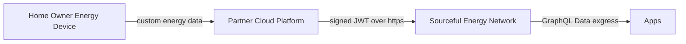
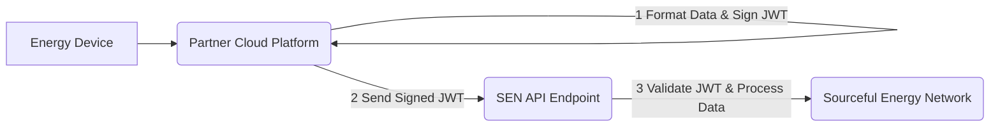
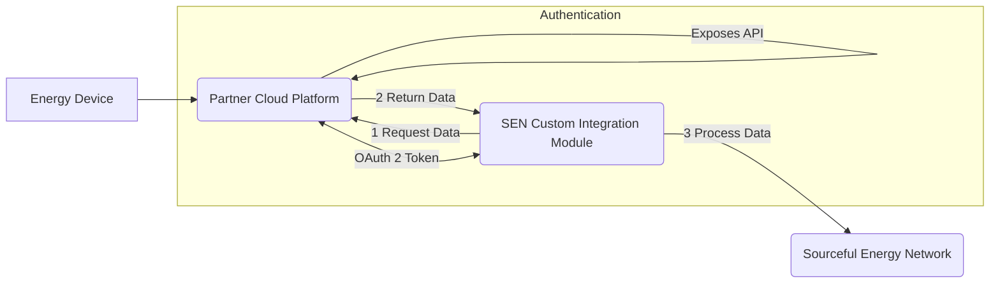

# Cloud-to-Cloud Integration with the Sourceful Energy Network (SEN)

## Introduction

This document outlines the methods for integrating third-party cloud platforms with the Sourceful Energy Network (SEN). The primary goal is to enable the secure transmission of energy data, originating from devices connected to a partner cloud, into the SEN.

This integration pattern assumes that device data (e.g., from inverters, batteries, meters) is already successfully reporting to your existing cloud infrastructure. The focus here is on the subsequent step: forwarding this data reliably and securely to the SEN.

The core security mechanism relies on signed JSON Web Tokens (JWTs), similar to the process used by hardware gateways directly connected to SEN. For background on the JWT structure and signing process, refer to the [Hardware Gateway Firmware Documentation](https://docs.sourceful.energy/developer/hardware).

**Overall Data Flow:**

## Core Data Ingress via Signed JWTs

All data sent from the partner cloud to the SEN **must** be encapsulated within a signed JWT. This ensures data authenticity and integrity.

To achieve this, the partner cloud platform **must** securely manage one or more private keys used for signing these JWTs. The corresponding public keys need to be registered within the SEN.

## Key Management Strategy

The partner cloud needs to decide on a key management strategy for signing JWTs. There are two primary approaches:

1.  **Global Private Key:**
    * **Description:** A single private key is used by the partner cloud service to sign data messages for *all* devices it manages.
    * **Pros:** Simpler to implement and manage initially.
    * **Cons:** If the key is compromised, data from *all* devices is potentially affected. Revoking the key impacts the entire fleet simultaneously.
    * **Suitability:** Best suited for scenarios where the data source is highly secure and tamper-proof (e.g., direct readings from sealed inverters/batteries managed solely by the partner cloud), minimizing the risk of data manipulation before it reaches the partner cloud.

2.  **Per-Device Private Keys:**
    * **Description:** Each individual device logically managed by the partner cloud has its own unique private key stored and used by the partner cloud for signing.
    * **Pros:** Granular security control. If one device's data stream or logical representation is compromised, its specific key can be revoked in SEN without affecting any other devices. Aligns with the hardware gateway model.
    * **Cons:** Requires more sophisticated key management within the partner cloud infrastructure (generation, storage, mapping keys to devices).
    * **Recommendation:** This is the **strongly recommended** approach for robust security and operational flexibility, allowing for individual device management and revocation.

The partner cloud is responsible for the secure storage and usage of the chosen private key(s).

## Integration Methods

There are two main methods for integrating a partner cloud with SEN:

1.  **Pushing Data to SEN:** The partner cloud actively sends data to SEN endpoints.
2.  **SEN Pulling Data:** SEN periodically requests data from the partner cloud via an API.

### Method 1: Pushing Data to SEN (Recommended)

This is the standard and more straightforward method for cloud-to-cloud integration, allowing partners to manage the integration process more directly.

**Overview:**
The partner cloud system takes device data, formats it according to the defined SEN specifications, signs it into a JWT using the appropriate private key (global or per-device), and sends it to designated SEN API endpoints.

**Diagram:**

**Requirements:**

1.  **Gateway Type Definition:** A specific "gateway type" needs to be defined in the SEN backend to represent the partner cloud integration. This will basically form the prefix for the "gateway id" Contact Sourceful Energy to set this up.
2.  **Gateway Registration:** Each logical gateway (represented by its unique identifier, i.e., serial number) and its corresponding **public key** must be registered in the SEN backend under the defined gateway type.
3.  **JWT Implementation:** The partner cloud must implement the JWT signing process using its managed private key(s).

**Onboarding Process:**

* The partner (or their end-users via the partner's interface) is typically responsible for onboarding devices into SEN.
* This involves associating the registered gateway (via its serial number) with:
    * A **Wallet Public Key:** The blockchain wallet address that will be associated with the energy data rewards/credits for this device.
    * **Position:** The geographical coordinates (latitude, longitude) of the physical resource.
* Sourceful Energy provides backend tools or APIs to facilitate this registration and onboarding process.

**Optional: Sourceful Energy App Integration:**

* To allow end-users to view and manage their devices (connected via the partner cloud) within the Sourceful Energy mobile app, an integration can be established.
* This typically requires:
    1.  **OAuth 2 Flow:** The user authorizes the Sourceful Energy App to access their device information *via* the partner cloud.
    2.  **Partner API Endpoints:** The partner cloud needs to expose simple API endpoints mimicking the hardware gateway's `api/crypto` (for public key retrieval) and `api/crypto/sign` (for signing challenges, proving identity) endpoints. This allows the SEN/App to verify the user's ownership during the OAuth flow.
* Customization options for the app onboarding experience can be provided for select partners.

### Method 2: SEN Pulling Data (Custom Implementation)

This method involves SEN actively fetching data from the partner cloud. It is generally reserved for specific use cases, primarily validation, and requires custom development by Sourceful Energy.

**Overview:**
Sourceful Energy develops and hosts a specific integration module within SEN that periodically calls an API exposed by the partner cloud to retrieve data.

**Diagram:**

**Requirements:**

1.  **Custom SEN Implementation:** Sourceful Energy needs to build and deploy the integration logic within SEN. This is done on a case-by-case basis.
2.  **Partner API:** The partner cloud must expose a stable, well-documented API endpoint from which SEN can pull data.
3.  **OAuth 2 Server:** The partner cloud must implement an OAuth 2 server to allow the SEN integration module to securely authenticate and obtain authorization to access the data API.

**Use Case & Limitations:**

* **Primary Use:** Often used for data validation or reconciliation purposes.
* **Infrequent Pulling:** Data is typically pulled infrequently (e.g., hourly, daily) and does **not** represent a real-time data stream suitable for all SEN features.
* **Not Real-Time:** Cannot be used for applications requiring low-latency data.
* **Requires Sourceful Development:** This method requires direct involvement and development resources from Sourceful Energy.

**Initiation:**
Partners interested in this model should contact Sourceful Energy directly to discuss feasibility and requirements.

## Current Scope and Future Considerations

* **Data Ingress Only:** Currently, cloud-to-cloud integration pathways primarily support **data ingress** – sending device data *to* the SEN.
* **Control:** Mechanisms for SEN to send control commands *back* to devices via the partner cloud are **not** currently standard features but may be considered for future development phases based on partner needs and use cases.

## Summary

Integrating a partner cloud with SEN involves securely transmitting device data using signed JWTs. Partners should:

1.  Choose a **Key Management Strategy** (Per-device recommended).
2.  Select an **Integration Method**:
    * **Push (Recommended):** Partner cloud sends data to SEN. Requires JWT signing, device/key registration, and partner-led onboarding. Offers potential for app integration via OAuth 2.
    * **Pull (Custom):** SEN retrieves data from the partner cloud API. Requires custom Sourceful implementation, partner API/OAuth 2, and is typically for non-real-time validation.
3.  Implement the necessary components (JWT signing, API endpoints, onboarding process).
4.  Be aware that current integrations focus on data ingress only.

Refer to the [Hardware Gateway Firmware Documentation](https://docs.sourceful.energy/developer/hardware) for details on the expected JWT format and signing algorithms. For specific API endpoints and setup procedures, please coordinate directly with the Sourceful Energy team.
