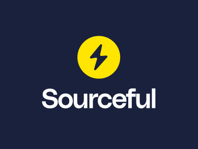
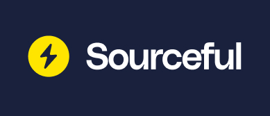
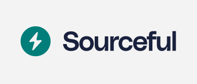
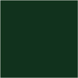
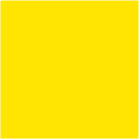

import boltDark from './img/design/thumbnails/Sourceful-Logo-Bolt-Dark.jpg';
import boltGreen from './img/design/thumbnails/Sourceful-Logo-Bolt-Green.jpg';
import boltLight from './img/design/thumbnails/Sourceful-Logo-Bolt-Light.jpg';
import boltTeal from './img/design/thumbnails/Sourceful-Logo-Bolt-Teal.jpg';
import boltYellow from './img/design/thumbnails/Sourceful-Logo-Bolt-Yellow.jpg';
import roundelDark from './img/design/thumbnails/Sourceful-Logo-Roundel-Dark.jpg';
import roundelGreen from './img/design/thumbnails/Sourceful-Logo-Roundel-Green.jpg';
import roundelLight from './img/design/thumbnails/Sourceful-Logo-Roundel-Light.jpg';
import roundelTeal from './img/design/thumbnails/Sourceful-Logo-Roundel-Teal.jpg';
import roundelYellow from './img/design/thumbnails/Sourceful-Logo-Roundel-Yellow.jpg';
import stackedDark from './img/design/thumbnails/Sourceful-Logo-Stacked-Dark.jpg';
import stackedGreen from './img/design/thumbnails/Sourceful-Logo-Stacked-Green.jpg';
import stackedLight from './img/design/thumbnails/Sourceful-Logo-Stacked-Light.jpg';
import stackedTeal from './img/design/thumbnails/Sourceful-Logo-Stacked-Teal.jpg';
import stackedYellow from './img/design/thumbnails/Sourceful-Logo-Stacked-Yellow.jpg';
import wideDark from './img/design/thumbnails/Sourceful-Logo-Wide-Dark.jpg';
import wideGreen from './img/design/thumbnails/Sourceful-Logo-Wide-Green.jpg';
import wideLight from './img/design/thumbnails/Sourceful-Logo-Wide-Light.jpg';
import wideTeal from './img/design/thumbnails/Sourceful-Logo-Wide-Teal.jpg';
import wideYellow from './img/design/thumbnails/Sourceful-Logo-Wide-Yellow.jpg';

import fredrikSittingTransparent from './img/photos/fredrik/fredrik-ahlgren-sitting-transparent-medium.png';
import fredrikSittingBWTransparent from './img/photos/fredrik/fredrik-ahlgren-sitting-bw-transparent-medium.png';
import fredrikSitting from './img/photos/fredrik/fredrik-ahlgren-sitting-medium.jpeg';
import fredrikSittingBW from './img/photos/fredrik/fredrik-ahlgren-sitting-bw-medium.jpeg';

import fredrikCoffey from './img/photos/fredrik/fredrik-ahlgren-coffey-medium.jpeg';
import fredrikCoffeyBW from './img/photos/fredrik/fredrik-ahlgren-coffey-bw-medium.jpeg';
import fredrikCoffeyTransparent from './img/photos/fredrik/fredrik-ahlgren-coffey-transparent-medium.png';
import fredrikCoffeyBWTransparent from './img/photos/fredrik/fredrik-ahlgren-coffey-bw-transparent-medium.png';

import fredrikJacket from './img/photos/fredrik/fredrik-ahlgren-jacket-medium.jpeg';
import fredrikJacketBW from './img/photos/fredrik/fredrik-ahlgren-jacket-bw-medium.jpeg';
import fredrikJacketTransparent from './img/photos/fredrik/fredrik-ahlgren-jacket-transparent-medium.png';
import fredrikJacketBWTransparent from './img/photos/fredrik/fredrik-ahlgren-jacket-bw-transparent-medium.png';

# Design manual and press

Our design manual is the go-to resource for developers when creating visual and graphic elements that represent our brand. It includes guidelines and rules for our logo, symbol, color scheme, typography, imagery, and tone of voice, ensuring consistency and cohesion in our branding across all touchpoints. The manual provides a clear and concise roadmap for developers to ensure that they are aligned with our company's values, goals, and messaging, helping to create a strong and recognizable brand in the marketplace.

## Logo Guidelines

Learn how to use our logo correctly and the rules that govern its use in all applications.

### Dark Mode Logos

| Light | Teal | Yellow |
|-------|------|--------|
|  |  |  |
| [SVG](./img/design/downloads/Sourceful-Logo-Bolt-Light.svg), [PNG](./img/design/downloads/Sourceful-Logo-Bolt-Light.png) | [SVG](./img/design/downloads/Sourceful-Logo-Bolt-Teal.svg), [PNG](./img/design/downloads/Sourceful-Logo-Bolt-Teal.png) | [SVG](./img/design/downloads/Sourceful-Logo-Bolt-Yellow.svg), [PNG](./img/design/downloads/Sourceful-Logo-Bolt-Yellow.png) |
|  |  |  |
| [SVG](./img/design/downloads/Sourceful-Logo-Roundel-Light.svg), [PNG](./img/design/downloads/Sourceful-Logo-Roundel-Light.png) | [SVG](./img/design/downloads/Sourceful-Logo-Roundel-Teal.svg), [PNG](./img/design/downloads/Sourceful-Logo-Roundel-Teal.png) | [SVG](./img/design/downloads/Sourceful-Logo-Roundel-Yellow.svg), [PNG](./img/design/downloads/Sourceful-Logo-Roundel-Yellow.png) |
|  |  |  |
| [SVG](./img/design/downloads/Sourceful-Logo-Stacked-Light.svg), [PNG](./img/design/downloads/Sourceful-Logo-Stacked-Light.png) | [SVG](./img/design/downloads/Sourceful-Logo-Stacked-Teal.svg), [PNG](./img/design/downloads/Sourceful-Logo-Stacked-Teal.png) | [SVG](./img/design/downloads/Sourceful-Logo-Stacked-Yellow.svg), [PNG](./img/design/downloads/Sourceful-Logo-Stacked-Yellow.png) |
|  |  |  |
| [SVG](./img/design/downloads/Sourceful-Logo-Wide-Light.svg), [PNG](./img/design/downloads/Sourceful-Logo-Wide-Light.png) | [SVG](./img/design/downloads/Sourceful-Logo-Wide-Teal.svg), [PNG](./img/design/downloads/Sourceful-Logo-Wide-Teal.png) | [SVG](./img/design/downloads/Sourceful-Logo-Wide-Yellow.svg), [PNG](./img/design/downloads/Sourceful-Logo-Wide-Yellow.png) |

### Light Mode Logos

| Dark | Green |
|------|-------|
|  |  |
| [SVG](./img/design/downloads/Sourceful-Logo-Bolt-Dark.svg), [PNG](./img/design/downloads/Sourceful-Logo-Bolt-Dark.png) | [SVG](./img/design/downloads/Sourceful-Logo-Bolt-Green.svg), [PNG](./img/design/downloads/Sourceful-Logo-Bolt-Green.png) |
|  |  |
| [SVG](./img/design/downloads/Sourceful-Logo-Roundel-Dark.svg), [PNG](./img/design/downloads/Sourceful-Logo-Roundel-Dark.png) | [SVG](./img/design/downloads/Sourceful-Logo-Roundel-Green.svg), [PNG](./img/design/downloads/Sourceful-Logo-Roundel-Green.png) |
|  |  |
| [SVG](./img/design/downloads/Sourceful-Logo-Stacked-Dark.svg), [PNG](./img/design/downloads/Sourceful-Logo-Stacked-Dark.png) | [SVG](./img/design/downloads/Sourceful-Logo-Stacked-Green.svg), [PNG](./img/design/downloads/Sourceful-Logo-Stacked-Green.png) |
|  |  |
| [SVG](./img/design/downloads/Sourceful-Logo-Wide-Dark.svg), [PNG](./img/design/downloads/Sourceful-Logo-Wide-Dark.png) | [SVG](./img/design/downloads/Sourceful-Logo-Wide-Green.svg), [PNG](./img/design/downloads/Sourceful-Logo-Wide-Green.png) |

[Download .zip archive](./img/design/downloads/Sourceful-Logos.zip)

## Typography Rules

Understand how to choose and use the right fonts in our designs, and their appropriate sizes and weights.

| Name/Download                                | Usage           |
|---------------------------------------------|----------------------------------------------|
| [PolySans Median](https://www.wearegradient.net/typefaces/polysans-standard/)    |  Headlines            |
| [Inter](https://fonts.google.com/specimen/Inter)    |  Paragraphs            |

## Color Scheme

Learn about our brand colors and how to use them consistently across all marketing materials and products.

| Example              | HEX     | RGB                | Usage           |
|----------------------|---------|--------------------|-----------------|
| | #19213D | RGB(25, 33, 61)  | Dark Midnight Blue   |
| | #11321C | RGB(17, 50, 28) | Tranquility Green    |
| | #017E7A | RGB(1, 126, 122) | Surfie Green   |
| | #00FF84 | RGB(0, 255, 132)   | Energetic Teal   |
| | #FF7A00 | RGB(255, 122, 0) | Heat Wave      |
| | #FFE500 | RGB(255, 229, 0)    | Golden Yellow     |

## Team

| Name | Role |
|---|---|
|  Fredrik Ahlgren | CEO, co-founder
|  Tobias Ohlsson | CTO, co-founder
|  Viktor Olofsson| CFO, co-founder
|  Johan Leitet |CCC, co-founder
|  Nikas Emevi | co-founder
|  David Mozart | co-founder

## Fredrik Ahlgren, CEO

"Dr. Fredrik Ahlgren, co-founder and CEO of Srcful"

| Color Transparent | Color Solid | Black and White Transparent | Black and White Solid |
|-------------|------|----|----|
|  
  [.png](./img/photos/fredrik/fredrik-ahlgren-sitting-transparent-medium.png), [.heic](./img/photos/fredrik/fredrik-ahlgren-sitting-transparent-medium.heic) 
   |
  [.jpeg](./img/photos/fredrik/fredrik-ahlgren-sitting-medium.jpeg), [.heic](./img/photos/fredrik/fredrik-ahlgren-sitting-medium.heic) 
 | 
  [.png](./img/photos/fredrik/fredrik-ahlgren-sitting-bw-transparent-medium.png), [.heic](./img/photos/fredrik/fredrik-ahlgren-sitting-bw-transparent-medium.heic) 
  |
  [.jpeg](./img/photos/fredrik/fredrik-ahlgren-sitting-bw-medium.jpeg), [.heic](./img/photos/fredrik/fredrik-ahlgren-sitting-bw-medium.heic) 
 |
|  
  [.png](./img/photos/fredrik/fredrik-ahlgren-coffey-transparent-medium.png), [.heic](./img/photos/fredrik/fredrik-ahlgren-coffey-transparent-medium.heic) 
  |
  [.jpeg](./img/photos/fredrik/fredrik-ahlgren-coffey-medium.jpeg), [.heic](./img/photos/fredrik/fredrik-ahlgren-coffey-medium.heic) 
 |  
  [.png](./img/photos/fredrik/fredrik-ahlgren-coffey-bw-transparent-medium.png), [.heic](./img/photos/fredrik/fredrik-ahlgren-coffey-bw-transparent-medium.heic) 
  |
  [.jpeg](./img/photos/fredrik/fredrik-ahlgren-coffey-bw-medium.jpeg), [.heic](./img/photos/fredrik/fredrik-ahlgren-coffey-bw-medium.heic) 
 |
|  
  [.png](./img/photos/fredrik/fredrik-ahlgren-jacket-transparent-medium.png), [.heic](./img/photos/fredrik/fredrik-ahlgren-jacket-transparent-medium.heic) 
  |
  [.jpeg](./img/photos/fredrik/fredrik-ahlgren-jacket-medium.jpeg), [.heic](./img/photos/fredrik/fredrik-ahlgren-jacket-medium.heic) 
 |  
  [.png](./img/photos/fredrik/fredrik-ahlgren-jacket-bw-transparent-medium.png), [.heic](./img/photos/fredrik/fredrik-ahlgren-jacket-bw-transparent-medium.heic) 
  |
  [.jpeg](./img/photos/fredrik/fredrik-ahlgren-jacket-bw-medium.jpeg), [.heic](./img/photos/fredrik/fredrik-ahlgren-jacket-bw-medium.heic) 
 |

