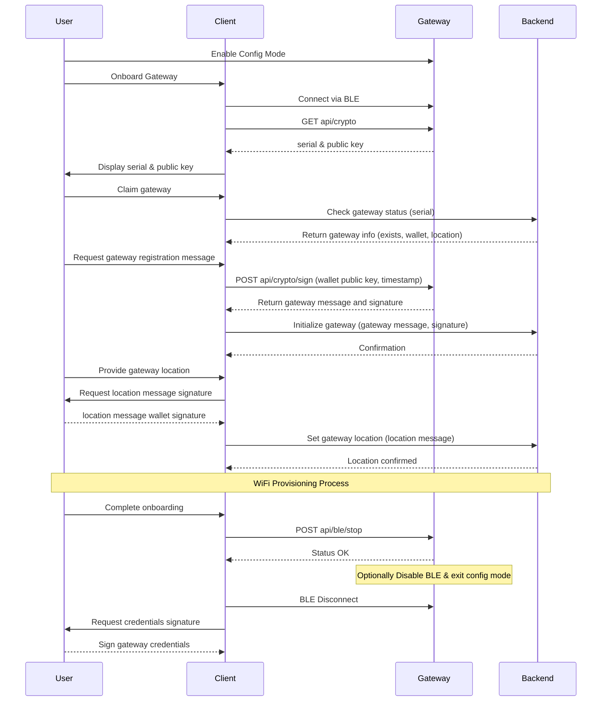
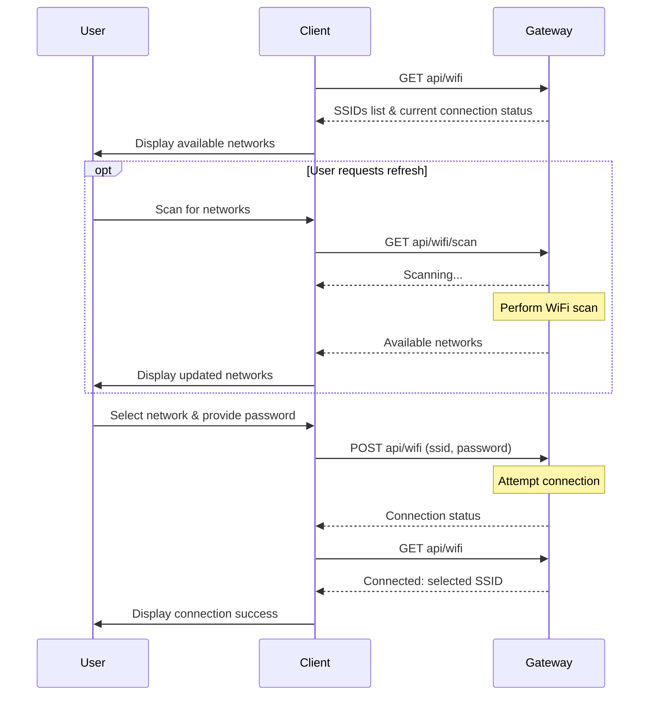

# Hardware/Firmware Guide
This document describes basic requirements for a device to be compatible with the Sourceful Energy Network (SEN). The focus is for firmware compatibility. Document is under development.

While there are many types of devices that can be connected to the SEN they are all regarded as gateways in the SEN, the gateway is then responsible for collecting data and controlling one or several energy resources. Some gateways are more specialized, e.g., a p1 reader (that essentially acts as a gateway to a smart energy meter) and some are more generic in nature, e.g., the Sourceful Energy Gateway.

The firmware for the Sourceful Energy Gateway is open source and can serve as a generic reference implementation: https://github.com/srcfl/srcful-gateway/

## Basics
A gateway needs to be identifiable and provide a public key. Gateway id and public key needs to be registered with SEN before the gateway is usable. Internally a gateway needs to maintain the private key and sign data.

All hardware devices will need to be audited and tested before granted access to the network and public release.

## Examples
### ESP32
There is an ESP32 example project under development at: https://github.com/srcfl/srcful-esp32-firmware-example

This example shows:
- Handling of cryptographic keys in software
- Construction and signing of data JWTs
- Construction and signing of Inception message
- BLE message protocol
- Important REST endpoints for onboarding (under construction)
- Safe storage of private key (TODO)

### Sourceful Energy Gateway Firmware
While in development the full firmware of the Sourceful Energy Gateway is open source and can work as a reference implementation. This firmware is suitable for micro computers such as raspberry pi 4+ that can run containerized applications.

You find the project here: https://github.com/srcfl/srcful-gateway

# Cryptographic Implementation
The SEN relies on cryptographic signatures to validate the source of data, ownership of gateways etc.

The SEN uses ECDSA (Elliptic Curve Digital Signature Algorithm) for cryptographic operations, implemented in two ways:
1. Hardware-based using ATECC608A/B secure elements
2. Software-based, e.g., using Python's `ecdsa` library

## Core Specifications
- **Algorithm**: ECDSA
- **Curve**: SECP256r1 
- **Key Sizes**: 
  - Private Key: 32 bytes (256 bits)
  - Public Key: 64 bytes (x,y coordinates, 32 bytes each)

## Software Implementation
If software keys are used it is imperative that the private key is stored in a secure way. The private key must not be stored in plain text in files, code nor as environment variables.

### Python Example
```python
import json
import base64
from cryptography.hazmat.primitives import hashes
from cryptography.hazmat.primitives.asymmetric import ec, utils

def base64url_encode(data: bytes) -> str:
    return base64.urlsafe_b64encode(data).rstrip(b'=').decode('utf-8')

# Generate a new private key
private_key = ec.generate_private_key(ec.SECP256R1())
public_key = private_key.public_key()

# Get the private key number
private_numbers = private_key.private_numbers()
private_key_hex = f"{private_numbers.private_value:064x}"
print(f"Private key: {private_key_hex}")

# Get the public key coordinates
public_numbers = public_key.public_numbers()
public_key_hex = f"{public_numbers.x:064x}{public_numbers.y:064x}"
print(f"Public key: {public_key_hex}")

# Create a JWT
header = {
    "alg": "ES256",
    "typ": "JWT",
    "device": "test123",
    "opr": "testing"
}

payload = {
    "message": "Hello, World!",
    "timestamp": 1234567890
}

# Encode header and payload
header_b64 = base64url_encode(json.dumps(header).encode())
payload_b64 = base64url_encode(json.dumps(payload).encode())

# Create message to sign
message = f"{header_b64}.{payload_b64}".encode()

# Hash the message
digest = hashes.Hash(hashes.SHA256())
digest.update(message)
message_hash = digest.finalize()

# Sign the message
signature = private_key.sign(
    message_hash,
    ec.ECDSA(utils.Prehashed(hashes.SHA256()))
)

# Convert DER signature to raw R,S format
r, s = utils.decode_dss_signature(signature)
signature_bytes = r.to_bytes(32, byteorder='big') + s.to_bytes(32, byteorder='big')
signature_b64 = base64url_encode(signature_bytes)

# Create final JWT
jwt = f"{header_b64}.{payload_b64}.{signature_b64}"
print(f"\nGenerated JWT:\n{jwt}")
```

## SEN Onboarding
Gateway id and public key needs to be registered with SEN before the gateway is usable. Basically, the id and public key is submitted to the network and then registered. In the future, this procedure will be automated through the developer platform and developer APIs.

Before a gateway is usable on the SEN, it must be tied to a wallet public key (inception), e.g., the user's wallet, and finally be given a correct physical location.

### Inception
The gateway must accept the wallet public key and add its own id and a cryptographic signature. The gateway then initializes the device in the SEN API.

When the gateway is tied to a wallet, further calls to this endpoint in the the SEN API will fail.

```graphql
mutation {
      gatewayInception {
        initialize(gatewayInitialization:{idAndWallet:"gateway_id:wallet_public_key", signature:"signature_of_idAndWallet"}) {
          initialized
        }
      }
    }
```

### Location
The location for a gateway is important from a standpoint of validity. The Network relies on accurate positions of resources, to e.g., know that a resource is part of a particular area.

Setting the location for a gateway is based on a signature from the owning wallet (see Inception above). The gateway hardware/keys are not part of this, and this part can thus be handled in different ways. The Sourceful Energy App offers setting the location of a device for all gateways a wallet has been paired with.

## User Experience
The user experience of onboarding can vary depending on the level of integration desired. Basically, it is up to each gateway firmware to provide the means for:

 - Network connectivity - most devices would need some kind of Network access, e.g., WiFi credentials
 - Inception/Initialisation
 - Location (Optional)


### Local Interface
In the simplest form, this is handled via the gateway itself, via a local interface, e.g., an internal webpage. This may be sufficient for a deeply technical product, possibly with other complex configuration of connected devices etc. The main caveat for a unified user experience in this case is the integration of the wallet key. There are, however, modules for most popular web frameworks that can handle this seamlessly. In the simplest case, the user will need to copy paste the wallet public key into the local interface. Depending on needs, the local interface can be as advanced as needed and provide a full user experience by utilizing the data egress of the SEN Network to do visualizations etc.

### Bespoke App
For a more non-technical user experience, a bespoke App that communicates with the gateway may be developed.

### Sourceful Energy App
The onboarding may be integrated into the Sourceful Energy App (SEA) for a seamless experience into the Network. Using the SEA, the user can always set location of an owned gateway. The SEA also offers Network connectivity, inception integration of the gateway, and a walletless mode (for users that do not have a separate crypto wallet) but this requires additional functionality in the gateway firmware. There are two basic ways to connect the client and the gateway for onboarding, soft ap or BLE. We recoomend ble for a smoother user experience and compatibility with web apps.

Wifi provisioning is an optional step and is placed last. The SEA does not require the gateway to have internet connectivity to be onboarded to the network per se (but it would obviously need to send data to the network at some point to be useful). Low spec devices can therefore do the onboarding using e.g. BLE only, no messages needs to be sent from the gateway to the backend during this process. The advantage is that the gateway does not need to maintain e.g. BLE stack and SSL Certificates at the same time. In essence the gateway can become operational after it has a wifi connection and BLE has been stoped.

Onboarding via BLE looks like this:



### Network Connectivity
Wifi provisioning is done using a few endpoints `GET api/wifi`, `POST api/wifi` and 'GET api/wifi/scan`. We reccomend that the gateway performs a network scan when entering its configuration mode. There is no call to scan per unless the user initiates it.

The wifi provisioning process looks like this:


# Local API Endpoints
The following endpoints need to be implemented to support onboarding in the SEA.

## REST Endpoints
- [Crypto Information](#crypto-information)
- [Crypto Sign](#crypto-sign)
- [WiFi Status](#wifi-status)
- [WiFi Configuration](#wifi-configuration)
- [WiFi Scan](#wifi-scan)
- [BLE Stop](#ble-stop)


## Crypto Information

Get cryptographic information about the device.

**Endpoint:** `/api/crypto`  
**Method:** `GET`  
**Content Type:** `application/json`

### Response

#### Success (200 OK)
```json
{
  "deviceName": "software_zap",
  "serialNumber": "DEVICE_SERIAL_NUMBER",
  "publicKey": "PUBLIC_KEY_HEX"
}
```

## Crypto Sign

Sign a message using the device's private key.

### Wallet Recovery
For gateways that are integrated into the SEA there is a need for a wallet recovery flow. The purpose is for users to be able to recover their wallet private key if it has been created in the SEA (this is naturally not possible for external wallets such as Phantom). The user will need their recovery key and acces to a gateway they have connected to the wallet. From the gateways perspective this is rather simple, all that is needed is an enpoint that can create a signature based on a message. This endpoint should be accessible via BLE or local Network access via mDNS.

The gateway would need to be put in eg. a mode that enables bluetooth, and the `ble/stop` message will be sent when the flow has finished and the gateway can resume normal operations.


**Endpoint:** `/api/crypto/sign`  
**Method:** `POST`  
**Content Type:** `application/json`

### Request Parameters

| Parameter | Type     | Required | Description                                                                      |
|-----------|----------|----------|----------------------------------------------------------------------------------|
| message   | string   | No       | Message to sign (must not contain \| (pipe) characters)                           |
| timestamp | string   | No       | Timestamp to use should be in UTC Y-m-dTH:M:SZ format eg 2025-01-17T18:20:12Z    |

### Response

#### Success (200 OK)
```json
{
  "message": "MESSAGE|NONCE|TIMESTAMP|SERIAL",
  "sign": "SIGNATURE_HEX"
}
```
If timestamp is not provided the device time will be used. This can be a problem if the device does not have the correct time, i.e. it has not established the correct time using e.g. NTP yet. In such cases a caller can inject the time instead.
**Note:** If no message is provided, the resulting message format will be `NONCE|TIMESTAMP|SERIAL` (without a leading pipe character).

#### Error (400 Bad Request) - When message contains pipe characters
```json
{
  "status": "error",
  "message": "Message cannot contain | characters"
}
```

#### Error (400 Bad Request) - When timestamp contains pipe characters
```json
{
  "status": "error",
  "message": "Timestamp cannot contain | characters"
}
```


## WiFi Status

Get current WiFi connection status and available networks.

**Endpoint:** `/api/wifi`  
**Method:** `GET`  
**Content Type:** `application/json`

### Response

#### Success (200 OK)
```json
{
  "ssids": [
    "Network1",
    "Network2",
    "Network3"
  ],
  "connected": "CONNECTED_NETWORK_NAME"
}
```

If not connected to any WiFi network, the "connected" field will be null.

## WiFi Configuration

Configure WiFi credentials for the device.

**Endpoint:** `/api/wifi`  
**Method:** `POST`  
**Content Type:** `application/json`

### Request Parameters

| Parameter | Type     | Required | Description              |
|-----------|----------|----------|--------------------------|
| ssid      | string   | Yes      | WiFi network name        |
| psk       | string   | Yes      | WiFi password            |

### Response

#### Success (200 OK)
```json
{
  "status": "success",
  "message": "WiFi credentials updated and connected"
}
```

#### Error (400 Bad Request)
```json
{
  "status": "error",
  "message": "Missing credentials"
}
```

#### Error (500 Internal Server Error)
```json
{
  "status": "error",
  "message": "Failed to connect with provided credentials"
}
```


## WiFi Scan

Initiate an asynchronous WiFi network scan.

**Endpoint:** `/api/wifi/scan`  
**Method:** `GET`  
**Content Type:** `application/json`

### Response

#### Success (200 OK)
```json
{
  "status": "scan initiated"
}
```


## BLE Stop

Schedule BLE service to stop.

**Endpoint:** `/api/ble/stop`  
**Method:** `POST`  
**Content Type:** `application/json`

### Response

#### Success (200 OK)
```json
{
  "status": "success",
  "message": "BLE shutdown scheduled"
}
```

#### Error (400 Bad Request) - When BLE not enabled
```json
{
  "status": "error",
  "message": "BLE not enabled"
}
```


## Authentication

None of these endpoints require authentication. The device is designed to be accessed on a local network or via BLE.

## Format of Responses

Responses are in JSON format with appropriate HTTP status codes. 

## Additional Notes

- These endpoints can be accessed both via HTTP and BLE interfaces
- BLE interfaces use a custom protocol to map these endpoints to BLE characteristics
- For timestamp formatting, the format is `YYYY-MM-DDThh:mm:ssZ` (UTC time) 


# SEN Data Ingress
Gateways send data to the SEN using a signed JSON Web Token (JWT) format. You can read more about the format specification here: https://jwt.io/introduction. Frequency of sending is 10 seconds, but may be more seldom. You may send several data packages in the same payload of the JWT but the data needs to be from the same energy resource for each JWT. E.g. if a gateway is connected to both an inverter and a meter the data from the inverter needs to be sent in one JWT (with optionally many datapoints) and data from the meter in another JWT (with optionally many datapoints). 

In particular, data is ingested using signed JWTs (not encrypted) via HTTPS. I.e., standard safe HTTPS transport is used to perform end-to-end encryption of the data.

## Header
The header consists of the standard fields plus extra protocol-specific fields.

```json
{
    "alg": "ES256",    
    "typ": "JWT",
    "device": "device_id",
    "opr": "testing",
    "licence": "device licence key",
    "developer": "developer licence key",
    "model": "model string",
    "dtype": "payload datatype specifics",
    "sn": "data serial number"
}
```

### Energy Meter Header Example
```json
{
  "alg": "ES256",
  "typ": "JWT",
  "device": "0123752ceb741f6eee",
  "opr": "production",
  "model": "p1homewizard",
  "dtype": "p1_telnet_json",
  "sn": "LGF5E360"
}
```

One note is that technically the `ES256R` algorithm/curve is used, that is ECDSA using SECP256r1 curve and SHA-256 and not ECDSA using P-256 curve and SHA-256.

## Payload
The body consists of the data the device sends, this data consists of one or more timestamped JSON objects. This is not generally standardized at this point. Timestamps are always in UTC.

### Energy Meter Payload Example
```json
{
  "1739352916813": {
    "serial_number": "LGF5E360",
    "rows": [
      "0-0:1.0.0(250212103510W)",
      "1-0:1.8.0(00010968.132*kWh)",
      "1-0:2.8.0(00000000.000*kWh)",
      "1-0:3.8.0(00000005.151*kVArh)",
      "1-0:4.8.0(00002109.781*kVArh)",
      "1-0:1.7.0(0000.253*kW)",
      "1-0:2.7.0(0000.000*kW)",
      "1-0:3.7.0(0000.000*kVAr)",
      "1-0:4.7.0(0000.084*kVAr)",
      "1-0:21.7.0(0000.064*kW)",
      "1-0:22.7.0(0000.000*kW)",
      "1-0:41.7.0(0000.161*kW)",
      "1-0:42.7.0(0000.000*kW)",
      "1-0:61.7.0(0000.028*kW)",
      "1-0:62.7.0(0000.000*kW)",
      "1-0:23.7.0(0000.000*kVAr)",
      "1-0:24.7.0(0000.000*kVAr)",
      "1-0:43.7.0(0000.000*kVAr)",
      "1-0:44.7.0(0000.052*kVAr)",
      "1-0:63.7.0(0000.000*kVAr)",
      "1-0:64.7.0(0000.032*kVAr)",
      "1-0:32.7.0(233.6*V)",
      "1-0:52.7.0(233.0*V)",
      "1-0:72.7.0(232.9*V)",
      "1-0:31.7.0(000.2*A)",
      "1-0:51.7.0(000.7*A)",
      "1-0:71.7.0(000.1*A)",
      "!0E78"
    ],
    "checksum": "0E78"
  }
}
```

## Signature
The signature is the signature generated by the device private key that can be verified by the public key.

### Full Signed JWT Energy Meter Example
```
eyJhbGciOiAiRVMyNTYiLCAidHlwIjogIkpXVCIsICJkZXZpY2UiOiAiMDEyMzc1MmNlYjc0MWY2ZWVlIiwgIm9wciI6ICJwcm9kdWN0aW9uIiwgIm1vZGVsIjogInAxaG9tZXdpemFyZCIsICJkdHlwZSI6ICJwMV90ZWxuZXRfanNvbiIsICJzbiI6ICJMR0Y1RTM2MCJ9.eyIxNzM5MzUyOTE2ODEzIjogeyJzZXJpYWxfbnVtYmVyIjogIkxHRjVFMzYwIiwgInJvd3MiOiBbIjAtMDoxLjAuMCgyNTAyMTIxMDM1MTBXKSIsICIxLTA6MS44LjAoMDAwMTA5NjguMTMyKmtXaCkiLCAiMS0wOjIuOC4wKDAwMDAwMDAwLjAwMCprV2gpIiwgIjEtMDozLjguMCgwMDAwMDAwNS4xNTEqa1ZBcmgpIiwgIjEtMDo0LjguMCgwMDAwMjEwOS43ODEqa1ZBcmgpIiwgIjEtMDoxLjcuMCgwMDAwLjI1MyprVykiLCAiMS0wOjIuNy4wKDAwMDAuMDAwKmtXKSIsICIxLTA6My43LjAoMDAwMC4wMDAqa1ZBcikiLCAiMS0wOjQuNy4wKDAwMDAuMDg0KmtWQXIpIiwgIjEtMDoyMS43LjAoMDAwMC4wNjQqa1cpIiwgIjEtMDoyMi43LjAoMDAwMC4wMDAqa1cpIiwgIjEtMDo0MS43LjAoMDAwMC4xNjEqa1cpIiwgIjEtMDo0Mi43LjAoMDAwMC4wMDAqa1cpIiwgIjEtMDo2MS43LjAoMDAwMC4wMjgqa1cpIiwgIjEtMDo2Mi43LjAoMDAwMC4wMDAqa1cpIiwgIjEtMDoyMy43LjAoMDAwMC4wMDAqa1ZBcikiLCAiMS0wOjI0LjcuMCgwMDAwLjAwMCprVkFyKSIsICIxLTA6NDMuNy4wKDAwMDAuMDAwKmtWQXIpIiwgIjEtMDo0NC43LjAoM
