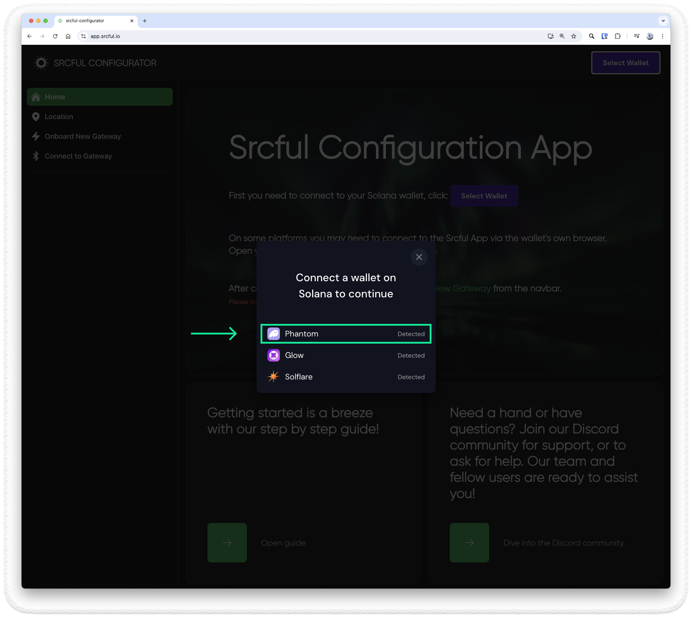
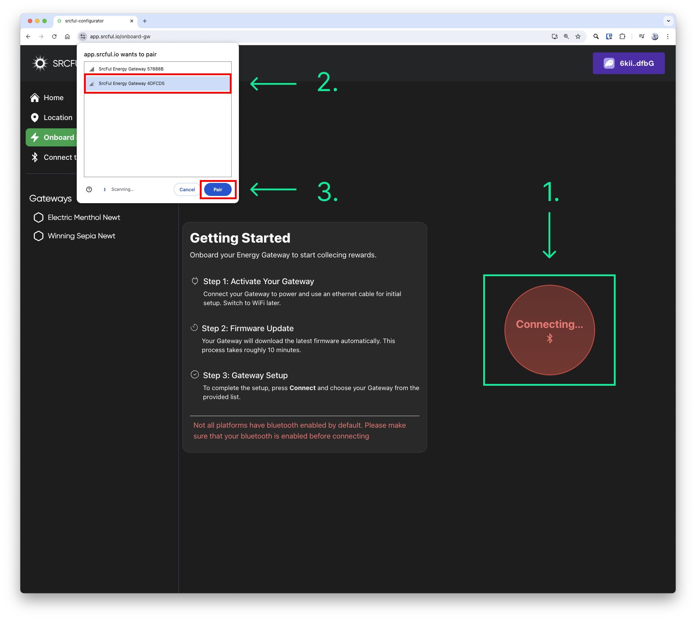
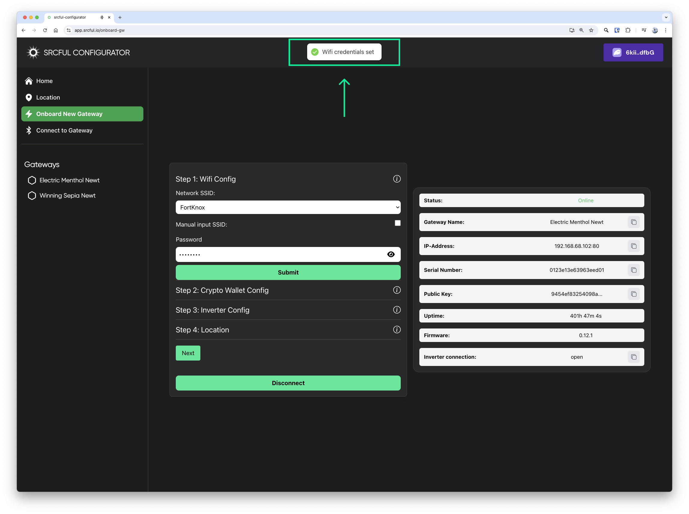
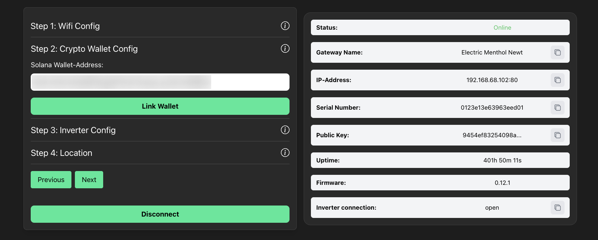
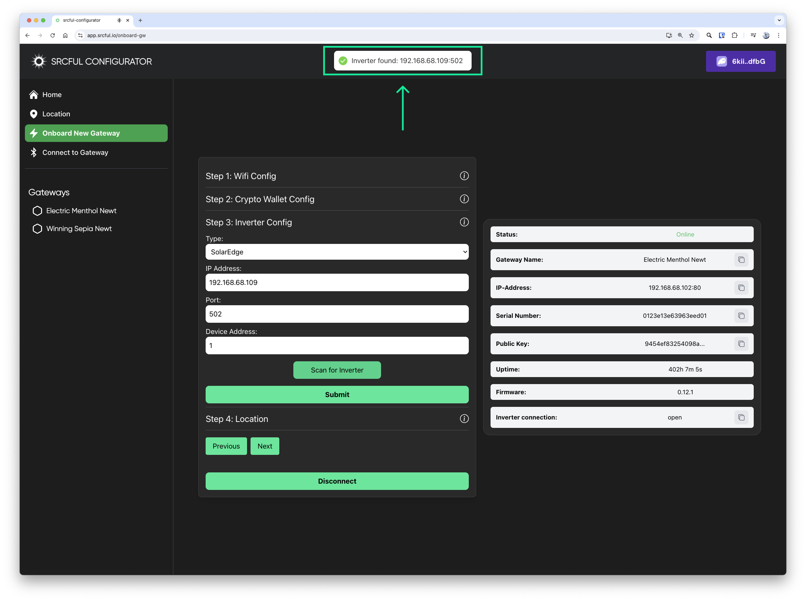
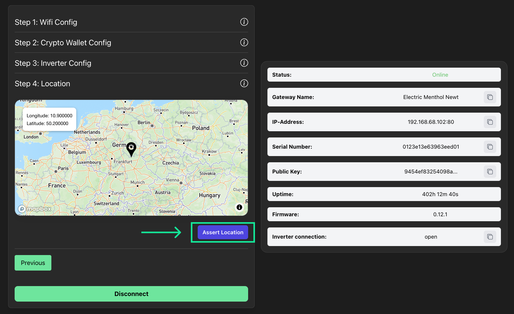

# Setup Guide: Energy Gateway

:::info Important

- You will need a compatible inverter to connect your Energy Gateway. Please see our list of compatible inverters: https://docs.srcful.io/energy-gateway/compatible-inverter/
- You will need a Solana Wallet to configure your Energy Gateway and to get beta token rewards. See our instructional video on how to set up Phantom: https://youtu.be/5G5H3nmAgwM

:::

 

    <iframe src="https://www.youtube.com/embed/3U-8tfRBY6g?si=_G290Uaygq71aTv1" title="YouTube video player" frameborder="0" allow="accelerometer; autoplay; clipboard-write; encrypted-media; gyroscope; picture-in-picture; web-share" referrerpolicy="strict-origin-when-cross-origin" allowfullscreen></iframe>

## Getting started

1. **Connect the Energy Gateway** to the internet using an Ethernet cable, and power it on by connecting the power cable.

2. **Wait approximately 10-15 minutes** for the Energy Gateway to start up and fetch the latest firmware. 

3. **If you wish to use Wi-Fi** instead of Ethernet, you can remove the Ethernet cable at this point.

## Pairing over Bluetooth

:::caution Info 

- **Be sure to be within close range of your Energy Gateway** to pair over Bluetooth.

- iPhones **cannot** be used for this process as of right now.

- You must have a **Solana Wallet** and a browser plugin (PC/Mac/Linux) like **Phantom** or **Solflare** or an app like Phantom or Solflare (Android) to be able to link your Wallet.

:::

1. **Visit https://app.srcful.io** to start pairing your Energy Gateway.

2. **Start by clicking the "Select Wallet"** button to link your Solana Wallet.

3. **Connect** your Solana Wallet, we recommend using **Phantom**.

4. **Start the pairing process** by clicking "Onboard New Gateway" in the left sidebar.

5. **Finish the pairing process** by selecting your Energy Gateway in the Bluetooth menu that pops up in your browser after clicking "Connect".

## Configuration

:::info

- To find your inverter's IP address, please refer to your router admin page, or use the **Scan** function.

- For other information regarding your inverter, please refer to the inverter documentation.

:::

1. **Start by selecting your Wi-Fi network** in the dropdown menu, and enter your password, and click Submit. You will see a small pop-up message when credentials has been set:

2. **Enter your Solana Wallet-Address**, and click **Submit**: 

3. **Select your inverter brand in the drop-down menu**, then enter your inverter information, or use the **Scan** function, then click **Submit**, you will see a small pop-up message once the inverter has been found and connected:

## Location

1. **Set your location** by dropping a pin on the map, then press **Assert Location**.

3. **Your Energy Gateway** should now be visible in the [**Srcful Explorer**](https://srcful.io)

## Troubleshooting

:::info Issues
- Should you lose connection to your Energy Gateway during the configuration process, you must refresh your browser window, and sometimes restart your Bluetooth.
- If you experience issues with several failed attempts or dropped connection, disconnect any other bluetooth devices that are paired to your computer or Android phone, then try again.
:::
