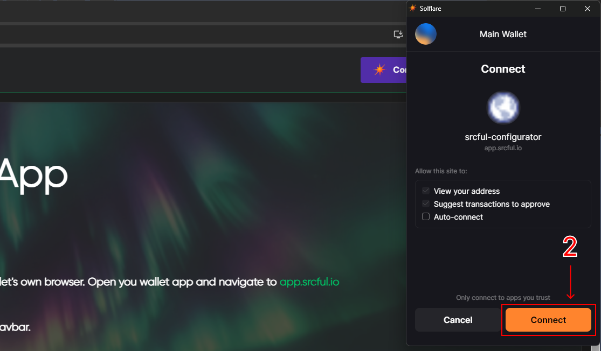
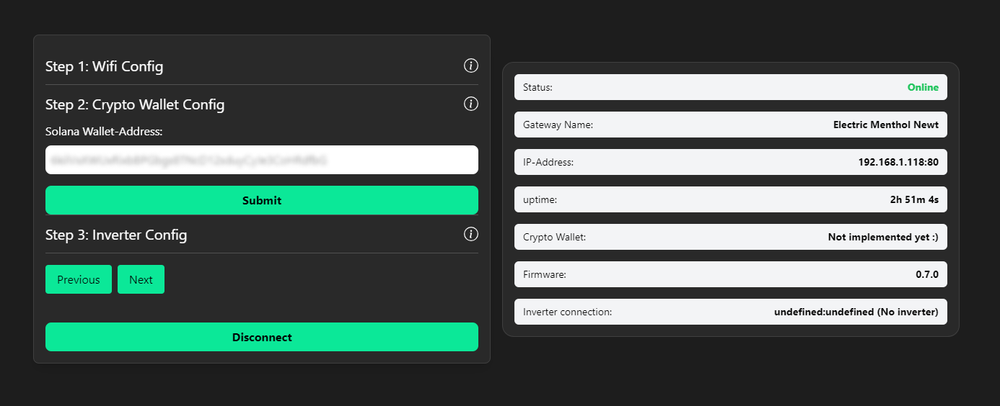
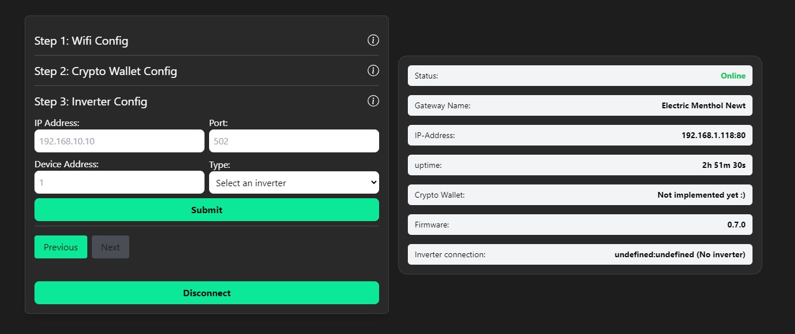

# Setup Guide: Energy Gateway

:::info Important

- You will need a compatible inverter to connect your Energy Gateway. Please see our list of compatible inverters: https://docs.srcful.io/energy-gateway/compatible-inverter/
- You will need a Solana Wallet to configure your Energy Gateway and to get token rewards.

:::

## Getting started

1. **Connect the Energy Gateway** to the internet using an Ethernet cable, and power it on by connecting the power cable.

2. **Wait approximately 10-15 minutes** for the Energy Gateway to start up and fetch the latest firmware. 

3. **If you wish to use Wi-Fi** instead of Ethernet, you can remove the Ethernet cable at this point.

## Pairing over Bluetooth

:::caution Info 

- **Be sure to be within close range of your Energy Gateway** to pair over Bluetooth.

- iPhones **cannot** be used for this process as of right now.

- You must have a **Solana Wallet** and a browser plugin (PC/Mac/Linux) like **Phantom** or **Solflare** or an app like Phantom or Solflare (Android) to be able to link your Wallet.

:::

1. **Visit https://app.srcful.io** to start pairing your Energy Gateway.

2. **Start by clicking the "Select Wallet"** button to link your Solana Wallet.

3. **Connect** your Solana Wallet.

4. **Start the pairing process** by clicking the hamburger menu and selecting "Onboard New Gateway".

5. **Finish the pairing process** by selecting your Energy Gateway in the Bluetooth menu that pops up in your browser.

## Configuration

:::info

- To find your inverter's IP address, please refer to your router admin page.

- For other information regarding your inverter, please refer to the inverter documentation.

:::

1. **Start by selecting your Wi-Fi network** in the dropdown menu, and enter your password, and click Submit. You will see it's IP Address when it has successfully connected:

2. **Enter your Solana Wallet-Address**, and click Submit: 

3. **Enter your Inverter information** and click Submit:

## Troubleshooting

:::info Issues
- Should you lose connection to your Energy Gateway during the configuration process, you must refresh your browser window, and sometimes restart your Bluetooth.
- If you experience issues with several failed attempts or dropped connection, disconnect any other bluetooth devices that are paired to your computer or Android phone, then try again.
:::